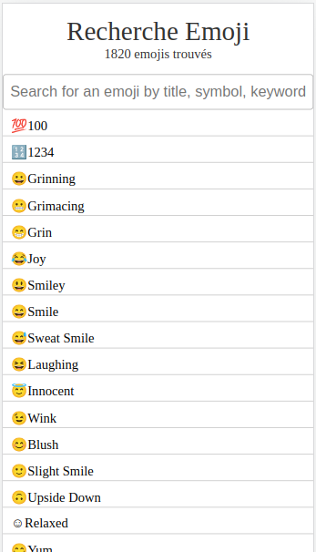

<h1 style="color: rgb(20, 41, 225)">EMOJI SEARCH</h1>

## A project created with [Vite](https://vitejs.dev/)

Type a name, a keyword, an emoji, and the app returns the characteristics of the corresponding emoji

**Coming soon** : click on an emoji to put it in the clipboard, and use it wherever you want
- - -
# TO SEE THIS PROJECT IN ACTION LOCALLY :

- git clone git@github.com:Tadkozh/EmojiSearch.git
- npm install
- npm run dev
- enjoy !

